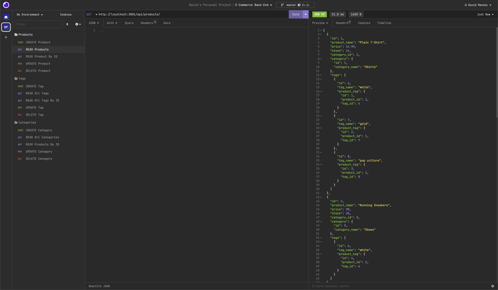

# { E-Commerce Back End }

## Badges

 

## Table of Contents

- [Links](#links)
- [Description](#description)
- [Installation](#installation)
- [Usage](#usage)
- [Credits](#credits)
- [License](#license)
- [Contribute](#contribute)
- [Tests](#tests)
- [Questions](#questions)

## Links
[E-Commerce Back End Walkthrough Video]()

## Description
This is the back end for an e-commerce site. It uses a working Express.js API and is configured to use Sequelize to interact with a MySQL database.

## Installation
Follow these commands to run the command-line application:  

    npm i
    cd ./db
    mysql -u root -p
    input password
    source schema.sql;
    exit;
    cd ..
    npm seed
    npm start
    ^C to exit

## Usage

  

## Credits

:bust_in_silhouette: [David Michael Mackey](https://www.notion.so/davidmichaelmackey/David-Mackey-a59ce61a996840d6a933e3b135673467?pvs=4) 
:email: [Email](mailto:davidmackey@hey.com) 
:octocat: [GitHub](https://github.com/davidmichaelmackey/) 
:briefcase: [Linkedin](https://linkedin.com/in/davidmichaelmackey/) 

### Resources

  [Sequelize](https://sequelize.org/docs/v6/) 
  [DotEnv](https://www.npmjs.com/package/dotenv) 
  [Async / Await](https://developer.mozilla.org/en-US/docs/Web/JavaScript/Reference/Statements/async_function) 
  [Try...Catch](https://developer.mozilla.org/en-US/docs/Web/JavaScript/Reference/Statements/try...catch) 
  [RESTful API's](https://en.wikipedia.org/wiki/Representational_state_transfer#Applied_to_web_services) 
  [HTTP Status Codes](https://developer.mozilla.org/en-US/docs/Web/HTTP/Status) 

## Toolset

    
    
    
    
    
    
    
      

## License

  

## Contribute

[Contributor Covenant](https://www.contributor-covenant.org/)

## Questions

Have Questions?
 
Feel free send me an [email](mailto:davidmackey@hey.com) or reach out to me on [Linkedin](https://linkedin.com/in/davidmichaelmackey/).
